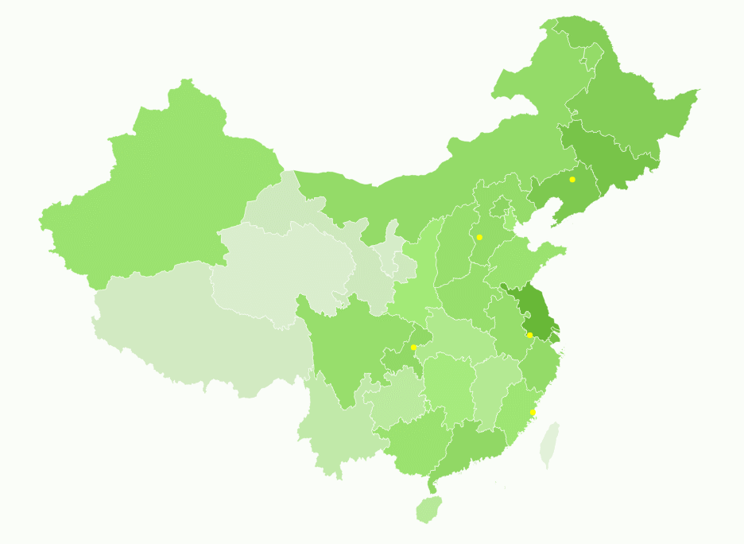

# Echarts中国地图引入自定义动画图标symbol

## 效果图


## 配置项

``` 配置项
option = {
        visualMap: {
          orient: "horizontal",
          type: "continuous",
          itemWidth: 9,
          itemHeight: 55,
          text: ["高", "低"],
          showLabel: true,
          seriesIndex: [0],
          min: 0,
          max: 5,
          inRange: {
            color: ["#e4f2dc", "#cde8bc", "#a3ea77", "#90d764", "#68b837"]
          },
          textStyle: {
            color: "#7B93A7",
            fontSize: 14
          }
        },
        tooltip: {
          show: true
        },
        geo: {
          roam: true,
          map: "china",
          //此处echarts4后遗留的bug，改用svg模式后normal不生效，字体大小被放大，目前可以换个思路解决，一般情况下字体给显示并且透明色transparent,鼠标经过显示白色
          label: {
            normal:{
                // //失效
                // show:false,
                // color:"#fff"
                //解决
                show:true,
                color:"transparent"
            },
            emphasis: {
              show:true,
              color:"#fff"
            }
          },

          itemStyle: {
            normal: {
              areaColor: "#a3ea77",
              borderColor: "#fff"
            },
            emphasis: {
              areaColor: "#68b837"
            }
          },
          regions: [
            {
              name: "南海诸岛",
              value: 0,
              itemStyle: {
                normal: {
                  opacity: 0,
                  label: {
                    show: false
                  }
                }
              }
            }
          ]
        },
        series: [
          {
            type: "map",
            map: "china",
            geoIndex: 0,
            aspectScale: 0.2, //长宽比
            showLegendSymbol: false, // 存在legend时显示
            label: {
              normal: {
                show: false
              },
              emphasis: {
                show: false,
                textStyle: {
                  color: "#fff"
                }
              }
            },
            roam: true,
            itemStyle: {
              normal: {
                areaColor: "#031525",
                borderColor: "#3B5077"
              },
              emphasis: {
                areaColor: "#2B91B7"
              }
            },
            animation: false,
            data: data
          },
          {
            name: "svg散点",
            type: "scatter",
            geoIndex: 0,
            data: renderdata,
            coordinateSystem: "geo",
            //此处引用svg动图
            symbol: "image://images/circle.svg",
            symbolSize: 10,
            animation:true,
            animationDelay: function(idx) {
              // 越往后的数据延迟越大
              return idx * 1000;
            }
          }
        ]
      };
```
## Project setup
```
yarn install
```

### Compiles and hot-reloads for development
```
yarn serve
```

### Compiles and minifies for production
```
yarn build
```

### Lints and fixes files
```
yarn lint
```

### Customize configuration
See [Configuration Reference](https://cli.vuejs.org/config/).


